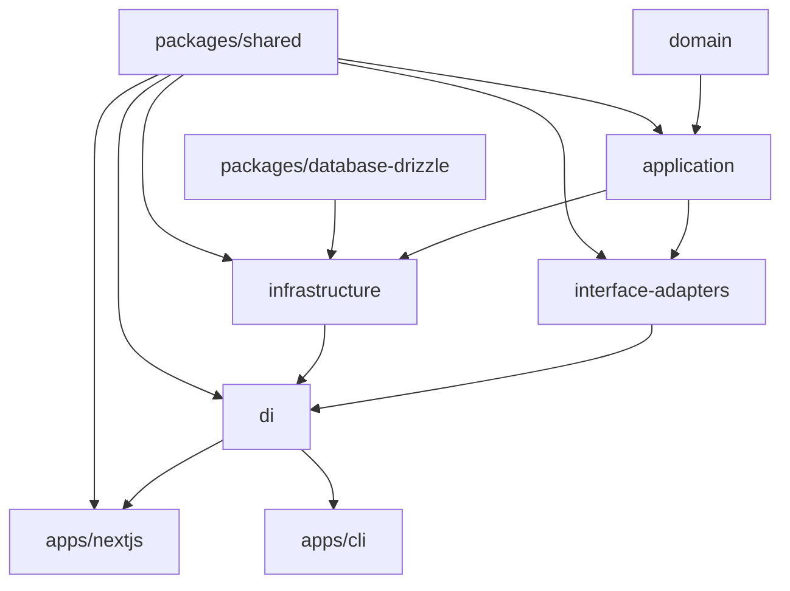

# 🧱 Clean Architecture Template for TypeScript Monorepos

This is a **Clean Architecture starter template** designed for monorepos using **Turborepo** + **pnpm** + **TypeScript**. It's simple enough to get started quickly and scalable enough to grow into a large production system.

---

## ⚡ Quick Start

```bash
git clone https://github.com/your-org/your-repo.git
cd your-repo
pnpm install
pnpm dev
```

---

## 🧠 What is Clean Architecture?

**Clean Architecture** is a way to structure your application so that:

- Business logic is **independent** from frameworks (e.g. Express, Next.js)
- Code is **testable**, **modular**, and easy to **extend**
- Dependencies always point **inward**, from outer layers toward the core

## 🤔 Why Clean Architecture?

Clean Architecture helps you:

- ✨ Write framework-agnostic business logic
- 🧪 Test use cases in isolation (no DB or HTTP server needed)
- 🧱 Structure your code for long-term maintainability
- 🧩 Easily swap implementations (e.g. Mongo → Postgres, REST → GraphQL)
- 👥 Onboard teammates faster with a predictable, layered system

---

## 🔰 Template Project Overview

This project follows a modular monorepo layout:

```bash
.
├── apps/                    # Applications (UI, CLI, etc)
│   ├── nextjs/              # Next.js frontend (App Router)
│   └── cli/                 # CLI tools (e.g., for batch scripts)
│
├── core/                   # Clean architecture layers
│   ├── domain/             # Business entities, value objects
│   ├── application/        # Use cases, interfaces
│   ├── interface-adapters/ # Controllers, adapters, presenters
│   ├── infrastructure/     # Implementations (e.g., repositories)
│   └── di/                 # Dependency injection setup
│
├── packages/               # Modular services
│   ├── database-drizzle/   # DB setup with Drizzle ORM
│   └── shared/             # Cross-cutting shared utils
│
├── configs/                # Centralized configuration presets
│   ├── config-eslint/      # Shared ESLint config
│   ├── config-typescript/  # Shared TSConfig presets
│   └── config-vitest/      # Shared Vitest setup
│
├── tools/                  # Toolchain scripts and helpers
│   ├── db/                 # DB migration + seed tooling
│   ├── mono/               # CLI wrapper for build/test/lint/dev
│   └── template/           # Reusable project template package
│
├── turbo.json              # Task orchestration config
└── pnpm-workspace.yaml     # Defines workspace structure
```

---

## 📦 Template Generator

To get started, copy and rename the `tools/template` package:

```bash
cp -r tools/template core/new-package
```

This includes:
- Standard tooling via `mono`
- `tsconfig`, `eslint`, `vitest` setup
- Example `lib` and test file

Just update the package name and start building!

---

## 🔧 Build Tooling with Turborepo + Mono

### 🧩 Centralized Toolchain via `tools/mono`

We build a custom toolchain named `mono` that we can easily manage to control the build process.

Instead of installing build tools (like esbuild, vitest, eslint) in every package, we centralize them via:

- `tools/mono`: Unified CLI for commands like `dev`, `test`, `build`
- `configs/*`: Shared config presets (eslint, tsconfig, vitest)

Example `mono` script:
```ts
const scripts: MonoScripts = {
  'lint:check': 'eslint src',
  'lint:fix': 'eslint src --fix',
  'test': 'vitest run',
  'test:watch': 'vitest watch',
  'build': 'esbuild ./src/index.ts --bundle --minify --platform=node --outfile=dist/index.js',
  'dev': 'tsx watch ./src/index.ts',
  'start': 'tsx ./src/index.ts',
  'check-types': 'tsc --noEmit',
};
```

### 🧪 How packages use `mono`

Each package delegates scripts to `mono`:
```json
{
  "scripts": {
    "dev": "mono dev",
    "start": "mono start",
    "build": "mono build",
    "test": "mono test",
    "test:watch": "mono test:watch",
    "lint:check": "mono lint:check",
    "lint:fix": "mono lint:fix",
    "check-types": "mono check-types"
  },
  "devDependencies": {
    "@acme/mono": "workspace:*",
    "@acme/config-eslint": "workspace:*",
    "@acme/config-typescript": "workspace:*",
    "@acme/config-vitest": "workspace:*"
  }
}
```

### 🛠 Root `package.json` dependencies
```json
{
  "devDependencies": {
    "turbo": "^2.4.4",
    "@vitest/coverage-istanbul": "^3.0.9",
    "typescript": "^5.8.2",
    "eslint": "^9.22.0",
    "esbuild": "^0.25.1",
    "prettier": "^3.5.3",
    "vitest": "^3.0.9"
  }
}
```

### 🧠 Workspace definition

```yaml
# pnpm-workspace.yaml
packages:
  - "apps/*"
  - "core/*"
  - "packages/*"
  - "configs/*"
  - "tools/*"
```

---

## 🔗 High-Level Dependency Diagram



---

## 🧠 Dependency Injection

Uses [`@thaitype/ioctopus`](https://www.npmjs.com/package/@thaitype/ioctopus), a fast, lightweight container with no `reflect-metadata` needed. You resolve anything with:

```ts
import { getInjection } from "@acme/di";
const userController = getInjection("UserController");
```

---

Happy coding! ✨ Let your architecture evolve, not collapse. 🏗️
