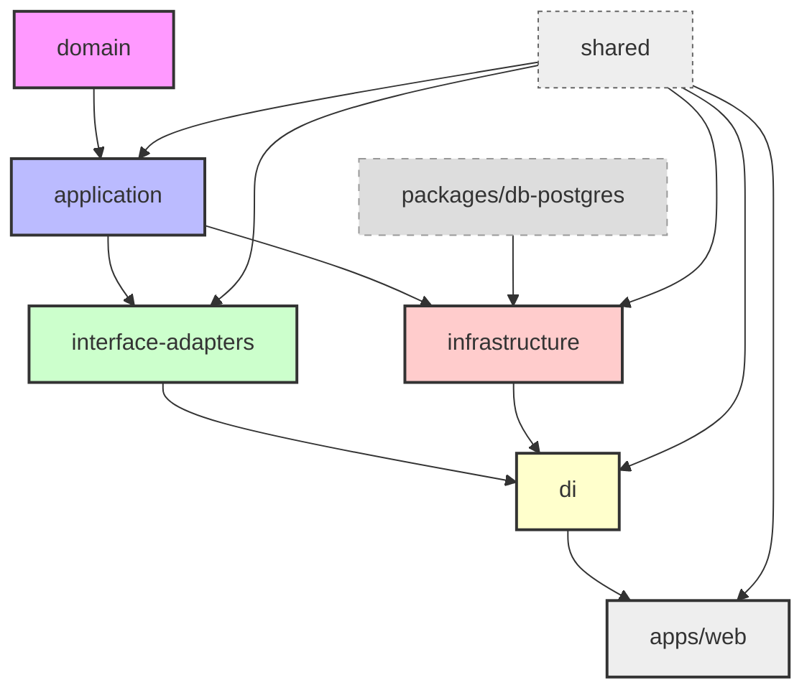
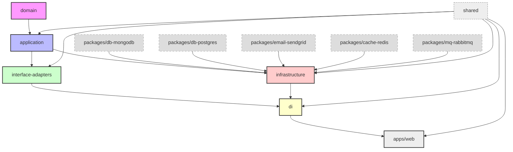

# 🧱 Clean Architecture Template for TypeScript Monorepos

This is a **Clean Architecture starter template** designed for monorepos using **Turborepo** + **pnpm** + **TypeScript**. It's simple enough to get started quickly and scalable enough to grow into a large production system.

---

## ⚡ Quick Start

```bash
git clone https://github.com/your-org/your-repo.git
cd your-repo
pnpm install
pnpm dev
```

---

## 🧠 What is Clean Architecture?

**Clean Architecture** is a way to structure your application so that:

- Business logic is **independent** from frameworks (e.g. Express, Next.js)
- Code is **testable**, **modular**, and easy to **extend**
- Dependencies always point **inward**, from outer layers toward the core

## 🤔 Why Clean Architecture?

Clean Architecture helps you:

- ✨ Write framework-agnostic business logic
- 🧪 Test use cases in isolation (no DB or HTTP server needed)
- 🧱 Structure your code for long-term maintainability
- 🧩 Easily swap implementations (e.g. Mongo → Postgres, REST → GraphQL)
- 👥 Onboard teammates faster with a predictable, layered system

---

### Core Principles:

| Layer                 | Responsibility                                                                 |
|----------------------|----------------------------------------------------------------------------------|
| **Domain**           | Business entities, rules, invariants (pure, stable)                             |
| **Application**      | Use cases, business workflows, interfaces for repositories/services             |
| **Interface Adapters** | Controllers, presenters, mappers, validators (connect input/output to use cases) |
| **Infrastructure**   | Concrete implementations of services, repositories (DB, APIs, email, etc.)      |
| **DI (Dependency Injection)** | Wiring dependencies to keep layers decoupled                                |

---

## 🚀 Starter Project Structure

A minimal setup that helps you get started quickly:

```bash
.
├── apps/
│   └── web/                  # App entry point (e.g., Next.js, Express)
├── core/
│   ├── domain/              # Business entities
│   ├── application/         # Use cases and interfaces
│   ├── interface-adapters/  # Controllers, mappers, validators
│   ├── infrastructure/      # Contracts only (not implementations)
│   └── di/                  # DI container & registry
├── packages/
│   └── db-postgres/         # Postgres implementation of repositories
└── shared/                  # Common types, utils, constants
```

## 🔗 High-Level Dependency Diagram

**Arrow direction (→)** means "depends on" or "uses" — the arrow always points from the **dependent** to the **dependency**.

### 🔍 Example Interpretation:
- `application → domain`  
  ↳ e.g., `CreateUserUseCase` uses `User` entity → `import { User } from "@acme/domain"`

- `interface-adapters → application`  
  ↳ e.g., `UserController` calls `CreateUserUseCase` → `import { CreateUserUseCase } from "@acme/application"`

- `infrastructure → application`  
  ↳ e.g., `UserRepository` implements `IUserRepository` → `import { IUserRepository } from "@acme/application"`

- `apps/web → di`  
  ↳ e.g., web app resolves controller via DI → `const userController = resolve("UserController")`

- `shared → all`  
  ↳ e.g., shared `utils`, `types`, or `constants` are imported across layers

For example:
- `application → domain` = Application layer depends on domain models
- `interface-adapters → application` = Controllers use application use cases
- `infrastructure → application` = Implementations depend on interfaces defined in application
- `apps/web → di` = App depends on the DI wiring



---

## 🌱 Future Project Structure (Scalable & Modular)

Once your project grows, the structure expands like this:

```bash
.
├── apps/
│   ├── web/                 # Web/API app
│   └── cli/                 # CLI commands (optional)
│
├── core/
│   ├── domain/
│   │   ├── entities/
│   │   ├── value-objects/
│   │   └── errors/
│   ├── application/
│   │   ├── use-cases/
│   │   │   ├── commands/
│   │   │   └── queries/
│   │   └── interfaces/
│   ├── interface-adapters/
│   │   ├── controllers/
│   │   ├── graphql/             # GraphQL resolvers
│   │   ├── cli/                 # CLI entry points
│   │   ├── webhooks/            # Webhook handlers (e.g., Stripe)
│   │   ├── events/              # Event-driven adapters (e.g., RabbitMQ)
│   │   ├── middlewares/         # HTTP middlewares
│   │   ├── presenters/          # View-friendly formatters (DTOs)
│   │   └── validators/          # Zod/Yup validators
│   ├── infrastructure/
│   │   ├── gateways/
│   │   └── persistence/
│   └── di/
│       ├── container.ts
│       ├── ServiceRegistry.ts
│       └── resolve.ts
│
├── packages/
│   ├── db-mongodb/          # MongoDB implementation
│   ├── db-postgres/         # PostgreSQL implementation
│   ├── cache-redis/         # Redis cache adapter (for ICacheService)
│   ├── mq-rabbitmq/         # RabbitMQ adapter (for IMessageQueueService)
│   ├── email-sendgrid/      # SendGrid adapter
│   └── logger-pino/         # Pino logger service
│
├── shared/
│   ├── types/
│   ├── utils/
│   ├── config/
│   └── constants/
│
├── tools/                   # Scripts, CLI helpers
└── design-system/           # (Optional) UI components
```

---

## 🔗 High-Level Dependency Diagram



---

## 🧠 Dependency Injection

This template uses [`@thaitype/ioctopus`](https://www.npmjs.com/package/@thaitype/ioctopus) — a simple, metadata-free IoC container for TypeScript that works across runtimes (Node, Edge, etc). 

However, this project use a forked version of `ioctopus` when the original package is fully support type-safety, this project will switch back to the original package, see [issue#3](https://github.com/thaitype/ioctopus/issues/3)

---

## 🧪 Example Usage

```ts
// apps/web/index.ts
import { resolve } from "@acme/di";

const userController = resolve("UserController");
await userController.create({
  body: { id: "u1", name: "Alice" },
});
```

---

## 🧪 Testing

Because each layer is isolated, you can easily test use cases like this:

```ts
import { CreateUserUseCase } from "@acme/application";

const mockRepo = {
  create: vi.fn(),
};

const useCase = new CreateUserUseCase(mockRepo);
await useCase.execute({ id: "u1", name: "Alice", email: "test@example.com" });
```

---

## 📚 Glossary

| Term              | Meaning                                                                 |
|-------------------|-------------------------------------------------------------------------|
| **Use Case**       | One unit of business logic (e.g. CreateUser)                            |
| **Controller**     | Handles incoming requests and calls use cases                          |
| **Presenter**      | Formats output for UI or external clients                              |
| **Gateway**        | Interface to external systems (e.g. DB, Email, Redis)                  |
| **Interface Adapter** | Layer that translates between external input/output and core logic     |
| **Repository**     | Contract for accessing data, implemented in infrastructure              |

---

## 🛠 Getting Started

1. Clone the repo
2. Run `pnpm install`
3. Start hacking in `/core/`

---

Happy coding! ✨ Let your architecture evolve, not collapse. 🏗️

---

## Q&A

### 🆚 Shared vs Domain

### `shared/`
- Generic, reusable code: utilities, types, config loaders, constants
- Not tied to any business logic
- Can be used by any layer **except** `domain`
- Example: `formatDate()`, `PaginatedResult<T>`, `Zod` validators

### `domain/`
- Contains business entities, rules, and core logic
- No external dependencies — must be 100% pure and stable
- Should not import from `shared` (to preserve isolation)
- Example: `User`, `Order`, `EmailAddress`, domain-specific errors
